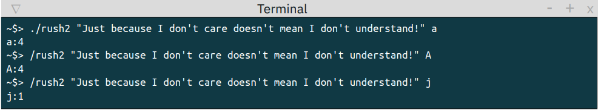
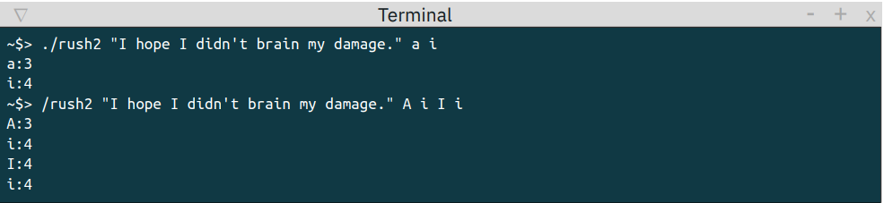
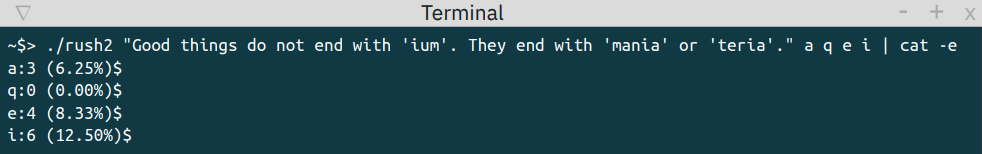
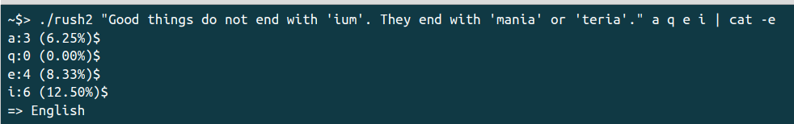

## RUSH 2

## 🧠 What is the goal?

During our second weekend at the pool, we were given a programming subject on Saturday at 10:00 a.m. and had to complete and defend it on Sunday at 10:00 a.m.

The project was divided into **4 steps**, gradually adding features to a letter-frequency analyzer.

---

## 1️⃣ Count a letter

The program counts the occurrences of a single letter, regardless of its case.

  

---

## 2️⃣ Count several letters

The program counts the occurrences of several letters and displays them in the required format.

  

---

## 3️⃣ Calculate frequencies

The program displays the frequency of each letter in the text.

  

---

## 4️⃣ Detect the language

Using [this array](https://en.wikipedia.org/wiki/Letter_frequency#Relative_frequencies_of_letters_in_other_languages) of letter frequencies for different languages, the program estimates the language in which the text was written.

  

---

## ⭐ Bonus

Customize the program and make it even more attractive!

---

*✎𓂃 By Antoine Sarrazin & Timéo Bavart*

